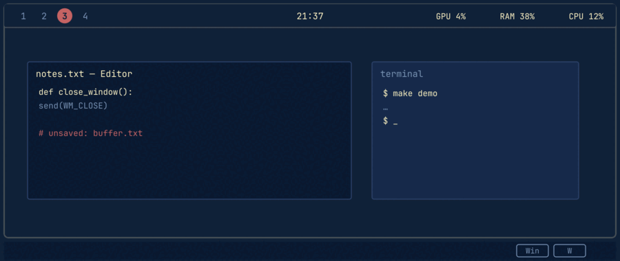

# WorkspaceOS

A **Hyprland-inspired desktop environment for Windows 10/11** — real workspaces, a BSP/Dwindle tiling window manager, and a Polybar-style top bar. Since 3.0 there is also a **native Linux daemon** (no Wine) that brings the same Dwindle tiling core, workspaces and keymap to Linux Mint / Ubuntu / Debian.

WorkspaceOS has two modes:

- **Plain mode** (default): windows behave completely normally; WorkspaceOS manages *workspaces, window assignment and productivity tools*. Nothing is tiled, ever.
- **Tiling mode** (Settings → Tiling): a real tiling window manager inspired by [Hyprland](https://hypr.land)'s Dwindle layout — a binary split tree per workspace, directional navigation, floating windows, gaps, preselection and pseudotiling.

 



*`Win+W` closes the focused window — apps get their normal save/exit path (it sends
`WM_CLOSE`, the same as the title-bar ✕), and the tiling engine re-adopts the freed
slot. Rebindable in Settings → Hotkeys.*

## Features

- **Tiling window manager** — Hyprland Dwindle-style BSP: dynamic splitting, preserve-split, smart split, split preselection, directional focus/move/resize, floating, pseudotiling, togglesplit, scratchpad, gaps, per-workspace × per-monitor layout trees, window rules, multi-monitor, DPI-aware
- **Workspaces on Windows' native Virtual Desktops** (`Win+1..9`) — the same real desktops as `Ctrl+Win+Arrow` and Task View. The hotkeys are captured by a **bundled AutoHotkey v2 runtime**, so the shell's taskbar shortcuts never fire; nothing about your taskbar is modified
- **Polybar-style top bar** — real Win32 appbar (reserves screen space): workspaces left, clock center, CPU/RAM/GPU/Disk/Net/Battery/Volume right
- **System monitor dashboard** — CPU, memory, GPU/VRAM, disk space & speed, network, top processes
- **Window rules** — auto-assign apps to workspaces; separate tiling rules (float / tile / ignore)
- **Window commands** — `Win+W` close, `Win+M` maximize, `Win+Shift+M` restore, `Win+C` center, `Win+F` fullscreen
- **Focus Mode** (`Win+F1`), **Launcher** (`Alt+Space`), **Clipboard manager** (`Win+V`), **Screenshot tool** (`Win+Shift+S`)
- **Everything configurable** — colors, fonts, hotkeys, gaps, split behavior, rules; JSON config with export/import

## Install

1. Download **WorkspaceOS-Setup.exe** from the [latest release](../../releases/latest)
2. Run it (per-user install, no admin required)
3. Done — WorkspaceOS starts immediately and on every login

> Silent install: `WorkspaceOS-Setup.exe /S` · Uninstall: Add/Remove Programs, or `Uninstall.exe /uninstall`
>
> On Linux? Version 3.0 ships a **native** `.deb` — no Wine, no Windows binaries — see [Linux install](#linux-install-native-deb).

## Setup tutorial (Windows, step by step)

First run, in order:

1. **Install** (above). The top bar appears at the top of the screen and WorkspaceOS
   starts with Windows. The installer bundles everything; no admin rights needed.
2. **Try workspaces.** Press `Win+2`, `Win+3`, … — the bar highlights the active
   workspace and every window you open belongs to the one you're on.
3. **Send a window somewhere.** Focus any window and press `Win+Shift+2` — it moves
   to workspace 2 and you follow it (configurable: `FollowMovedWindow`).
4. **Close a window from the keyboard.** `Win+W` sends the same close request as the
   title-bar X — apps with unsaved work will ask before quitting.
5. **Enable tiling (opt-in).** Gear icon on the bar → Settings → Tiling →
   "Enable tiling window manager". New windows now tile Dwindle-style; `Win+H/J/K/L`
   move focus, `Win+Shift+H/J/K/L` move windows, `Win+Shift+T` toggles it off again.
6. **Make it yours.** Everything — bar colors/fonts, hotkeys, gaps, split behavior,
   workspace names, per-app rules — lives in Settings. Advanced users can edit
   `%APPDATA%\WorkspaceOS\config.json` directly (see
   [docs/CONFIGURATION.md](docs/CONFIGURATION.md)).
7. **Verify hotkeys work.** See the AutoHotkey section below — this is the one part
   of setup that can genuinely need attention.

### AutoHotkey: what it does and how to set it up

**Do I have to install AutoHotkey first? No.** The installer and the portable
zip both **bundle** the AutoHotkey v2 runtime (`AutoHotkey64.exe`). Out of the
box you never download or install anything — route A below needs no action.
A manual install (route D) or a custom path (route C) is only for special
setups; and if the runtime is ever missing, WorkspaceOS still works and falls
back to its built-in keyboard hook.

**Why it exists.** Windows hard-codes `Win+0..9` to launch/activate taskbar-pinned
apps, and the shell always wins the `RegisterHotKey` race for those combos. Rather
than modifying your taskbar, WorkspaceOS ships a tiny **AutoHotkey v2 script** whose
only job is to see `Win+3` first, swallow it, and tell WorkspaceOS over a named pipe.
The app does all the work; the script holds no logic. AutoHotkey is also more reliable
than the built-in hook for every other binding, so the generated script covers all of
your hotkeys, not just `Win+1..9`.

**Pick ONE of these routes (A is the default and needs no action):**

- **A — Bundled (recommended).** Both the installer and the portable zip ship
  `AutoHotkey64.exe` (v2). It is found automatically next to `WorkspaceOS.exe` or in
  an `AutoHotkey\` subfolder. Nothing to download, nothing to install.
- **B — Built from source.** `build.ps1` downloads the runtime into
  `publish\AutoHotkey\` automatically, so a from-source build is self-contained too.
- **C — Custom path.** Install AutoHotkey v2 wherever you like, then in Settings →
  Tiling set "AutoHotkey path" to the full path of `AutoHotkey64.exe` and press Save
  (stored as `Tiling.AutoHotkeyPath` in config.json). Use this if you keep runtimes
  on a different drive or want a specific version.
- **D — System-wide install.** Install [AutoHotkey v2](https://www.autohotkey.com/download/)
  normally. WorkspaceOS finds it on `PATH` or at
  `%ProgramFiles%\AutoHotkey\v2\AutoHotkey64.exe`.

Resolution order when starting: config path → bundled (next to the exe, or
`AutoHotkey\` subfolder) → `PATH` (`AutoHotkey64.exe`, then `AutoHotkey.exe`) →
`%ProgramFiles%\AutoHotkey\v2\AutoHotkey64.exe`.

**Verify it is running:**

1. Settings → Tiling → AutoHotkey status should read **Running**.
2. Press `Win+2`: the bar should switch to workspace 2 — and no taskbar app launches.
3. The log at `%APPDATA%\WorkspaceOS\workspaceos.log` shows
   `AutoHotkey: started …` and `AutoHotkey: script written (N hotkeys)`.

**If it is not running:** open Settings → Tiling, make sure "Run bundled AutoHotkey"
(`Tiling.EnableAutoHotkey`) is enabled and press Save — the bridge restarts and the
script is regenerated from your current bindings. If the status stays off, the log
says why (missing runtime vs. start failure). WorkspaceOS never stops working without
it: the built-in low-level hook takes over, but the shell usually keeps `Win+1..9`
in that mode — which is exactly what the bridge exists to fix.

**Security software:** some AV/EDR products block low-level keyboard hooks,
including AutoHotkey's. The log will show the hook failure and WorkspaceOS falls
back automatically. Allowlisting `AutoHotkey64.exe` restores full capture.

### What the AutoHotkey bridge does behind the scenes

1. At startup (and whenever you change a hotkey) the app generates
   `%APPDATA%\WorkspaceOS\workspaceos.ahk` from your bindings.
2. The bundled runtime runs it; the script captures each chord and sends one line
   (e.g. `ws:3`, `focus:left`, `CloseWindow`) over the
   `\\.\pipe\WorkspaceOS.Ctrl` named pipe.
3. Lifecycle is handled for you: single instance, stray processes from crashed
   sessions are killed, restart with backoff if it dies, a watchdog restarts it if
   it silently stops, and it shuts down with the app.

## Linux install (native .deb)

Since 3.0.0 the `.deb` is a **native Linux daemon** (`workspaceos_<version>_amd64.deb`):
no Wine, no Windows binaries. It compiles the same Dwindle layout core and reads the
same `config.json` as the Windows build, and drives your existing desktop through the
standard X11 tooling (wmctrl/xdotool/xprop, pulled in as dependencies).

**Keybindings are set up automatically.** There is no AutoHotkey equivalent to install
on Linux: on install and at every login the daemon registers your WorkspaceOS keymap
**directly with your desktop environment** — Cinnamon custom keybindings on Linux Mint,
MATE run-commands, or a generated `xbindkeys` config elsewhere. Your desktop captures
`Win+1..9`, `Win+H/J/K/L`, … and runs `workspaceos action <Name>`; the daemon does the
rest. Edit a hotkey in `~/.config/WorkspaceOS/config.json` and the keymap is
re-applied automatically — no relogging, no manual binding editor.

**Steps (Linux Mint 21.x / 22.x, or Ubuntu/Debian):**

1. **Download the `.deb`** from the [latest release](../../releases/latest), e.g.
   `workspaceos_3.0.0_amd64.deb`.

2. **Install it** — apt pulls in `wmctrl`, `xdotool`, `x11-utils`, … automatically:

   ```bash
   sudo apt install ./workspaceos_3.0.0_amd64.deb
   ```

3. **That's it.** The keymap is live immediately (the installer registers it with
   your running session), and the daemon autostarts at login (systemd user service
   plus XDG autostart). `Win+1..9` switch workspaces, `Win+W` closes the focused
   window, and so on — same defaults as Windows.

4. **Enable tiling** (opt-in, like on Windows):

   ```bash
   workspaceos action ToggleTiling
   ```

   or set `"Tiling": { "EnableTiling": true }` in `~/.config/WorkspaceOS/config.json`.
   New windows then tile Dwindle-style: `Win+H/J/K/L` focus, `Win+Shift+H/J/K/L` move,
   `Win+Ctrl+H/J/K/L` resize, `Win+Shift+Space` float, `Win+P` togglesplit.

**CLI** (all of it talks to the daemon over `$XDG_RUNTIME_DIR/workspaceos.sock`):

| Command | What it does |
|---|---|
| `workspaceos status` | daemon reachable? tiling on/off |
| `workspaceos keys` | show the active keymap as registered on X11 |
| `workspaceos retile` | force a re-tile of the current workspace |
| `workspaceos action CloseWindow` | run any named hotkey action |

**Requirements & limitations:**

- X11 sessions (Cinnamon, MATE, XFCE, and other EWMH window managers). On Wayland
  sessions the daemon manages Xwayland windows only — native Wayland capture is not
  implemented yet.
- Workspaces are the desktop's native virtual desktops; the tiling engine keeps one
  tree per (workspace × desktop) like on Windows.
- No AutoHotkey, no Wine, no .NET runtime to install: the deb ships a self-contained
  single-file daemon.

**Uninstall:**

```bash
sudo apt remove workspaceos
# optional: removes your WorkspaceOS config
rm -rf ~/.config/WorkspaceOS
```

## Default keybindings

### Workspaces (work with or without tiling)

| Keys | Action |
|---|---|
| `Win+1..9` | Switch to workspace N (AutoHotkey-intercepted; taskbar apps do NOT open) |
| `Win+Shift+1..9` | Send focused window to workspace N (tiling-aware) |
| `Win+Shift+T` | Tiling on/off |

### Tiling (when enabled)

| Keys | Action |
|---|---|
| `Win+H` / `Win+J` / `Win+K` / `Win+L` | Focus left / down / up / right |
| `Win+Shift+H/J/K/L` | Move (swap) window left / down / up / right |
| `Win+Ctrl+H/J/K/L` | Resize split (step configurable, default 5%) |
| `Win+Shift+Space` | Toggle floating for the focused window |
| `Win+P` | togglesplit — flip the split under the focused window |
| `Win+Shift+P` | pseudotile — keep preferred size inside the tiled slot |
| `Win+Shift+Arrow` | Preselect the next split direction (one-shot) |
| `Win+S` | Toggle the scratchpad (optional, off by default) |

### Productivity

| Keys | Action |
|---|---|
| `Win+W` | Close focused window (sends WM_CLOSE — apps get their save/exit path) |
| `Win+M` / `Win+Shift+M` | Maximize / restore |
| `Win+C` | Center window |
| `Win+F` | Borderless fullscreen toggle |
| `Win+F1` | Focus Mode |
| `Alt+Space` | Launcher / command palette |
| `Win+V` | Clipboard history |
| `Win+Shift+S` | Screenshot |

All hotkeys are rebindable in **Settings → Hotkeys**. Combos Windows reserves are taken over via a low-level keyboard hook; **Win+number combos are handled by the bundled AutoHotkey runtime**, which reliably intercepts them before the shell (see below). Conflicting bindings are flagged in the Hotkeys tab.

## How Win+number works (and why AutoHotkey)

Windows hard-codes `Win+0..9` to launch/activate taskbar-pinned apps, and the
shell wins `RegisterHotKey` races for them. To own these keys **without
disabling or modifying the taskbar**, WorkspaceOS ships a tiny generated
AutoHotkey v2 script:

1. At startup the app generates `%APPDATA%\WorkspaceOS\workspaceos.ahk` from
   your current hotkey bindings (all `Win+1..9` up to your workspace count,
   plus the tiling keys).
2. It runs the **bundled** `AutoHotkey64.exe` against that script. AutoHotkey's
   keyboard hook sees the chord first and swallows it, so the shell's taskbar
   shortcut never triggers.
3. The script sends one line over the named pipe `\\.\pipe\WorkspaceOS.Ctrl`
   (e.g. `ws:3`, `focus:left`, `float`). The app — not the script — does all
   the work: switching, tiling, focus, geometry. The script holds no logic.
4. Lifecycle: single instance enforced, killed stray instances from crashed
   sessions, auto-restart with backoff if it dies, shut down with the app, and
   a watchdog restarts it if it ever silently stops.
5. If AutoHotkey is missing or blocked, WorkspaceOS falls back to its built-in
   low-level hook (which covers most bindings; the shell usually keeps
   Win+number in that case).

## Build from source

Requirements: [.NET 8 SDK](https://dot.net). The Windows app builds/runs on Windows 10/11; the Linux daemon builds on any Linux with .NET 8 (no Windows needed).

```powershell
.\build.ps1
```

Outputs `publish\WorkspaceOS.exe` (self-contained app), `publish\WorkspaceOS-Setup.exe` (installer, bundles AutoHotkey) and `publish\WorkspaceOS-<version>-portable.zip` (portable). The AutoHotkey runtime is downloaded on demand during the build; tests run first. No other tooling needed — the installer is compiled with the C# compiler that ships with Windows.

The Linux daemon builds from the same tree on any .NET 8 machine:

```bash
dotnet publish src/WorkspaceOS.Linux/WorkspaceOS.Linux.csproj -c Release -r linux-x64 --self-contained true \
  -p:PublishSingleFile=true -p:IncludeNativeLibrariesForSelfExtract=true -o publish-linux
```

CI runs the tests on Windows and Linux on every push; tagging `v*` builds and publishes a GitHub release with the exe, installer, portable zip and the **native** `workspaceos_<version>_amd64.deb`.

## Configuration

Settings live in `%APPDATA%\WorkspaceOS\config.json` and are fully editable through the Settings UI (gear icon on the bar) or by hand. See [docs/CONFIGURATION.md](docs/CONFIGURATION.md) — including the `Tiling` section (gaps, split behavior, rules, AutoHotkey).

## Troubleshooting

**`Win+1` opens a taskbar app instead of switching workspace.**
The AutoHotkey bridge isn't running. Check Settings → Tiling → AutoHotkey status; enable "Run bundled AutoHotkey" and press Save. If you installed the bare exe (no installer), place `AutoHotkey64.exe` (v2, from [autohotkey.com](https://www.autohotkey.com/download/)) next to `WorkspaceOS.exe` or in an `AutoHotkey\` subfolder — or set a custom path in Settings. Everything is also logged in `%APPDATA%\WorkspaceOS\workspaceos.log`.

**A window never gets tiled.**
It probably matches a tiling rule (Settings → Tiling → rules) or the engine classified it as a dialog/tool window. Maximizing a window removes it from the tree until restored. Check the log with "Debug logging" enabled for the adoption decision.

**Windows flicker or fight the layout.**
Lower `InnerGap`/`OuterGap` to 0 and disable "Smart split"; if a specific app misbehaves, add an "Ignore" or "Float" rule for it. The engine debounces events (80 ms) and skips redundant `SetWindowPos` calls, so constant flicker almost always means an app re-positioning itself — float it.

**Hotkeys stopped working entirely.**
Security software can block keyboard hooks. The log will show hook installation failures. Also check Settings → Hotkeys warnings: two actions bound to the same combo disable each other.

**Multi-monitor: windows land on the wrong screen.**
The engine keeps one tree per monitor per workspace and re-syncs on display changes. If a monitor was disconnected, hit Apply in Settings (or toggle tiling) to force a resync.

**Reset everything.**
Delete `%APPDATA%\WorkspaceOS\config.json` (and `workspaceos.ahk`) with WorkspaceOS not running.

## Architecture

```
src/WorkspaceOS/
  Core/
    Interop/       Win32 P/Invoke surface (monitors, DWM, WinEvents, appbar)
    Hotkeys/       RegisterHotKey + low-level keyboard hook fallback
    AutoHotkey/    bundled AHK v2 bridge: script generation + process lifecycle
    Ipc/           named-pipe command server (AHK → app)
    Tiling/        the layout engine: LayoutTree (pure BSP/Dwindle core) + TilingEngine (Win32)
    WindowSystem/  window enumeration, manageability + tile-candidate rules, window commands
    Workspaces/    native virtual desktops, workspace rules, pinning
    Metrics/       perf counters, CoreAudio volume, battery, network deltas
    Focus/         focus timer, blocked-app watchdog, history
    Clip/          clipboard listener + history store
  UI/              top bar (appbar), monitor, settings (incl. Tiling tab), focus, launcher, clipboard, screenshot
src/WorkspaceOS.Linux/  native Linux daemon (reuses LayoutTree + config core; X11 via wmctrl/xdotool,
                    keymap auto-registration for Cinnamon/MATE/xbindkeys, unix-socket IPC + CLI)
installer/         self-extracting setup (in-box csc, dual payload: app + AutoHotkey)
tests/             layout-core + Linux keymap unit tests (xUnit)
```

**Tiling layering:** `LayoutTree` is a pure model (binary split tree, ratios, gaps, geometry, neighbor search, resize) with zero Win32/UI dependencies and full unit tests. `TilingEngine` owns one tree per (workspace × monitor), listens to WinEvents (show/destroy/focus/minimize/movesize), evaluates tiling rules, applies rectangles through `SetWindowPos` with change-detection and event-feedback suppression, manages floating windows, the scratchpad, the DWM active-window indicator and workspace-switch adoption. Workspaces remain Windows' **native Virtual Desktops** driven through the shell COM services; the tiling engine tracks which windows live on which desktop so layouts never mix between workspaces.

## Known limitations

- Memory usage is above the original 50 MB target (~120–250 MB working set) — cost of the self-contained WPF stack; idle CPU is near 0%.
- CPU/GPU temperatures depend on WMI/vendor support and often read *n/a* without vendor SDKs.
- Desktop switching uses the shell's internal virtual-desktop COM interfaces (stable across Windows 10 1809–22H2); on other builds it falls back to simulating `Ctrl+Win+Arrow`.
- The active-window indicator uses the Windows 11 DWM border-color attribute; on Windows 10 it is a no-op.
- Some security software blocks low-level keyboard hooks (including AutoHotkey's). Hotkeys then fall back to the built-in hook, and the shell usually keeps Win+number.
- Elevated (admin) windows can only be tiled when WorkspaceOS itself runs elevated; anything the engine cannot move is logged and skipped.
- Fullscreen games are deliberately never retiled; borderless-fullscreen toggling stays available via `Win+F`.
- The setup exe is unsigned, so SmartScreen may warn on first run (More info → Run anyway).

## License

MIT
